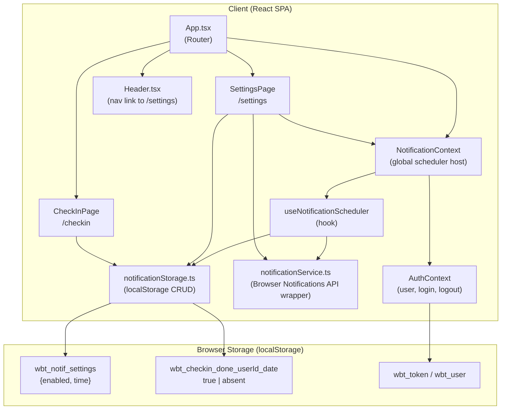

# Architecture: US-001 — Daily Check-in Reminder

**Jira Story:** [KAN-1](https://santoshhawle.atlassian.net/browse/KAN-1)
**Date:** 2026-05-15
**Author:** Architecture Designer
**Status:** Reviewed

---

## 1. Architecture Style

**Chosen: Extend the existing SPA (React/TypeScript) with a pure client-side feature module.**

The existing application is a React + Vite SPA backed by a Node/Express REST API. This story's scope is explicitly client-only (client-side scheduler, localStorage, Browser Notifications API). Introducing a new service or microservice would add infrastructure overhead with zero benefit. The correct approach is to add a self-contained feature module inside the existing client — consistent with how `AuthContext`, `api.ts`, and existing pages are structured.

No backend changes are required.

### Resolved Design Issues Incorporated

- **H-1 (Notification click navigation):** `notificationService.ts` is a plain module with no React Router access. Notification `onclick` uses `window.focus()` + `window.location.href = '/checkin'` instead of `navigate()`. This is the only safe mechanism from a non-React context.
- **H-2 (CheckInPage modification):** `client/src/pages/CheckInPage.tsx` must be modified to call `markCheckedInToday(userId)` after a successful log submission (see Section 8).
- **H-3 (Settings reactivity):** `NotificationContext` exposes a `updateSettings(settings)` function. `SettingsPage` calls this instead of writing directly to storage, so the context can cancel the current `setTimeout` and reschedule.
- **H-4 (Null user guard):** The scheduler hook waits for `AuthContext.isLoading === false` and `user !== null` before reading localStorage keys or scheduling any timeout.
- **M-1 (Unsupported browser degradation):** If `'Notification' in window` is false, the opt-in toggle is rendered as disabled with an inline message: "Browser notifications are not supported in this browser."
- **M-2 (localStorage error handling):** All `notificationStorage` read/write calls are wrapped in `try/catch`. On error, reads return safe defaults (`{ enabled: false, time: '09:00' }`); writes are silently no-ops. Errors are surfaced to the caller via a boolean `success` return value so the UI can show feedback.
- **M-3 (Sleep/hibernate desync):** On scheduler initialisation and after every timeout fires, the scheduler compares the date stored in the check-in flag key against today's local date. If the stored date is stale (prior day), it is cleared before evaluating suppression logic.
- **M-4 (Settings keyed per user):** `wbt_notif_settings` is keyed per user: `wbt_notif_settings_<userId>`. On logout, `AuthContext.logout()` calls `notificationStorage.clearUserData(userId)` to remove both the settings key and any stale daily flag.

---

## 2. Component Diagram

---

## 3. Technology Stack

| Layer | Technology | Rationale |
|---|---|---|
| UI Framework | React 18 + TypeScript | Existing stack — no change |
| Routing | React Router v6 | Existing — add `/settings` route |
| Styling | Tailwind CSS | Existing — Settings page follows same design system |
| Notification API | Browser Notifications API (Web API) | Native, no library needed; `Notification.requestPermission()` + `new Notification()` |
| Persistence | `localStorage` | Already used for auth (`wbt_token`, `wbt_user`); same pattern for notification preferences and daily flag |
| Scheduling | `setTimeout` / `clearTimeout` | Client-side only per scope; compute ms-until-target-time and schedule. Negative delay (time already passed today) clamps to tomorrow. Stale-date check on init handles device sleep/hibernate desync. |
| State / Context | React Context API | `NotificationContext` wraps the scheduler so it is mounted once at app root |
| Build | Vite | Existing — no change |
| Backend | Node/Express | **No changes required for this story** |

---

## 4. Data Flow

### Primary Scenario: User opts in, reminder fires, user checks in

---

## 5. External Services

| Service | Purpose | Notes |
|---|---|---|
| Browser Notifications API | Fire in-browser notifications | Native Web API — no third party. Requires user permission. Degrades gracefully if unsupported. |
| `localStorage` | Persist settings and daily flag | Native Web API — no third party |

No new external or third-party services are introduced.

---

## 6. Security Approach

| Concern | Strategy |
|---|---|
| Permission | `Notification.requestPermission()` is called only on explicit user opt-in. If denied, opt-in is reverted and the user is informed via an inline UI message. No notification is ever sent without permission. |
| localStorage key namespacing | All keys are namespaced per user ID: `wbt_notif_settings_<userId>`, `wbt_checkin_done_<userId>_<YYYY-MM-DD>`. Prevents cross-user data leakage on shared devices. |
| localStorage error handling | All reads/writes in `notificationStorage.ts` are wrapped in `try/catch`. Reads return safe defaults on error; writes return a `success: boolean`. Safari private mode and quota exceeded are handled without crashing. |
| Settings cleared on logout | `AuthContext.logout()` calls `notificationStorage.clearUserData(userId)` to remove all user-scoped keys. |
| Null user guard | The scheduler does not initialise until `AuthContext.isLoading === false` and `user !== null`, preventing `null`-keyed localStorage operations. |
| Input validation | The time picker value is validated to be a valid `HH:mm` string before being stored. Out-of-range values are rejected in the UI. |
| XSS via notification body | Notification title/body are static strings constructed in code — no user-controlled data is interpolated into the notification body. |
| Unsupported browser degradation | On mount, `SettingsPage` checks `'Notification' in window`. If false, the opt-in toggle is rendered as disabled with an inline message: "Browser notifications are not supported in this browser." |
| No secrets | This feature introduces zero secrets, tokens, or API keys. |

---

## 7. Key Design Decisions

| # | Decision | Rationale | Trade-off |
|---|---|---|---|
| D-1 | **Client-side scheduler only (no Service Worker)** | Scope explicitly excludes background push. `setTimeout` is simpler, zero infrastructure, and aligns with the agreed limitation. | Notification will not fire if the tab is closed — documented in scope as a known limitation. |
| D-2 | **`NotificationContext` mounted at app root; exposes `updateSettings()`** | The scheduler `setTimeout` must survive page navigation. `updateSettings()` lets `SettingsPage` trigger a cancel-and-reschedule without direct setTimeout access. | Adds one React Context to the tree; negligible overhead. |
| D-3 | **`localStorage` keyed per user for all notification data** | Prevents cross-user contamination on shared devices. Cleared on logout via `notificationStorage.clearUserData(userId)`. | Data is device-local — if user logs in from a different browser, they see default settings. Acceptable for v1. |
| D-4 | **`notificationService.ts` as a plain module (not a hook)** | Permission request and `new Notification()` are stateless operations that do not need React lifecycle. Keeps the service independently testable. `onclick` uses `window.location.href` (no React Router dependency). | n/a |
| D-5 | **New `/settings` route added to existing router** | Follows the established routing pattern in `App.tsx`. Protected by `PrivateRoute` so unauthenticated users cannot access it. | Requires adding a nav link in `Header.tsx`. |
| D-6 | **Stale-date guard on scheduler init** | Handles device sleep/hibernate across midnight. On init (and after each timeout fires), scheduler compares today's local date against the stored flag date and clears stale flags before evaluating suppression logic. | Small extra localStorage read per scheduler cycle — negligible. |
| D-7 | **Negative delay clamped to tomorrow** | If the app starts after the configured reminder time has passed today, `msUntil` would be negative. Scheduler detects this and schedules for the same time the next day instead of firing immediately. | n/a |

---

## 8. New Files / Changes Summary

| Action | Path | Description |
|---|---|---|
| New | `client/src/services/notificationService.ts` | Browser Notifications API wrapper (permission + send) |
| New | `client/src/services/notificationStorage.ts` | localStorage CRUD for settings and daily check-in flag |
| New | `client/src/hooks/useNotificationScheduler.ts` | Hook that owns the `setTimeout`/midnight-reset lifecycle |
| New | `client/src/contexts/NotificationContext.tsx` | Context provider mounted at app root to host the scheduler |
| New | `client/src/pages/SettingsPage.tsx` | Settings UI — opt-in toggle + time picker; calls `NotificationContext.updateSettings()` on save; shows disabled state + message when Notifications API unsupported |
| Modify | `client/src/App.tsx` | Add `/settings` protected route; wrap with `NotificationProvider` |
| Modify | `client/src/components/Header.tsx` | Add Settings nav link |
| Modify | `client/src/pages/CheckInPage.tsx` | Call `notificationStorage.markCheckedInToday(userId)` after successful log submission (FR-7) |
| Modify | `client/src/contexts/AuthContext.tsx` | Call `notificationStorage.clearUserData(userId)` inside `logout()` (M-4 fix) |
