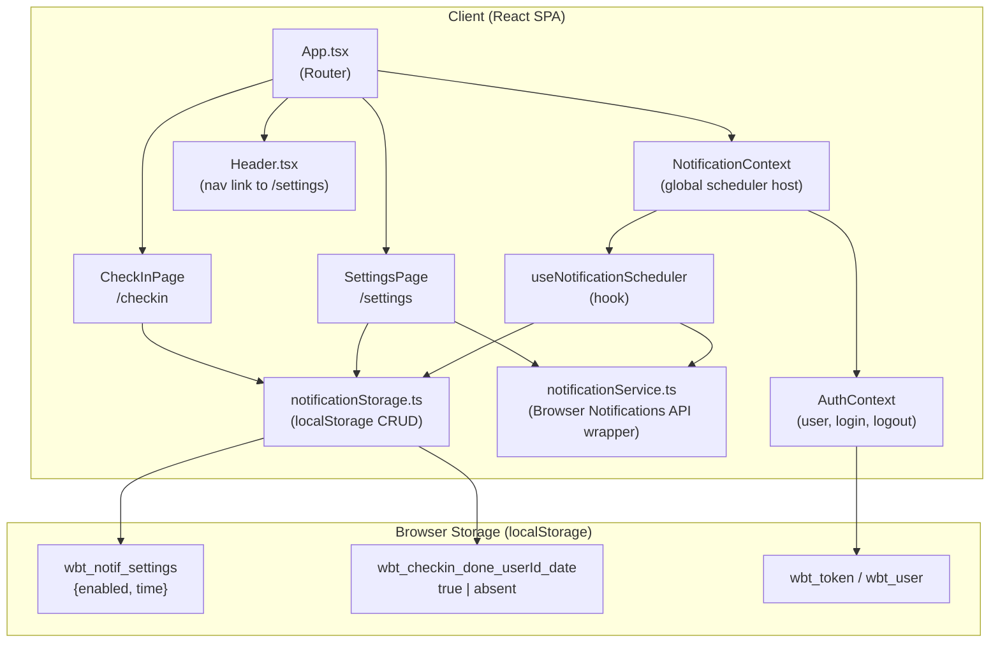
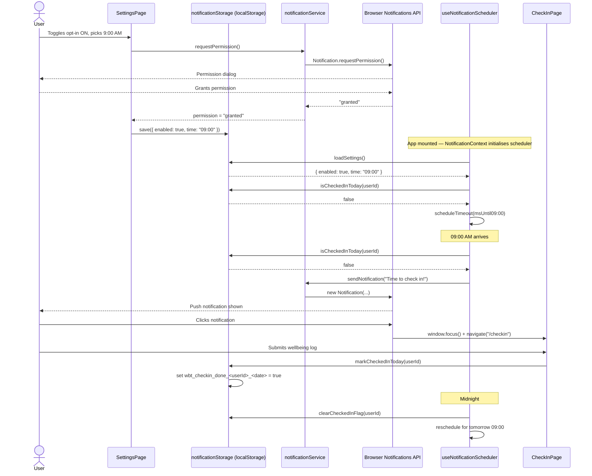

# Architecture: US-001 — Daily Check-in Reminder

**Jira Story:** [KAN-1](https://santoshhawle.atlassian.net/browse/KAN-1)
**Date:** 2026-05-15
**Author:** Architecture Designer
**Status:** Draft

---

## 1. Architecture Style

**Chosen: Extend the existing SPA (React/TypeScript) with a pure client-side feature module.**

The existing application is a React + Vite SPA backed by a Node/Express REST API. This story's scope is explicitly client-only (client-side scheduler, localStorage, Browser Notifications API). Introducing a new service or microservice would add infrastructure overhead with zero benefit. The correct approach is to add a self-contained feature module inside the existing client — consistent with how `AuthContext`, `api.ts`, and existing pages are structured.

No backend changes are required.

---

## 2. Component Diagram

---

## 3. Technology Stack

| Layer | Technology | Rationale |
|---|---|---|
| UI Framework | React 18 + TypeScript | Existing stack — no change |
| Routing | React Router v6 | Existing — add `/settings` route |
| Styling | Tailwind CSS | Existing — Settings page follows same design system |
| Notification API | Browser Notifications API (Web API) | Native, no library needed; `Notification.requestPermission()` + `new Notification()` |
| Persistence | `localStorage` | Already used for auth (`wbt_token`, `wbt_user`); same pattern for notification preferences and daily flag |
| Scheduling | `setTimeout` / `clearTimeout` | Client-side only per scope; compute ms-until-target-time and schedule |
| State / Context | React Context API | `NotificationContext` wraps the scheduler so it is mounted once at app root |
| Build | Vite | Existing — no change |
| Backend | Node/Express | **No changes required for this story** |

---

## 4. Data Flow

### Primary Scenario: User opts in, reminder fires, user checks in

---

## 5. External Services

| Service | Purpose | Notes |
|---|---|---|
| Browser Notifications API | Fire in-browser notifications | Native Web API — no third party. Requires user permission. Degrades gracefully if unsupported. |
| `localStorage` | Persist settings and daily flag | Native Web API — no third party |

No new external or third-party services are introduced.

---

## 6. Security Approach

| Concern | Strategy |
|---|---|
| Permission | `Notification.requestPermission()` is called only on explicit user opt-in. If denied, opt-in is reverted and the user is informed. No notification is ever sent without permission. |
| localStorage key namespacing | Keys are namespaced per user ID (`wbt_checkin_done_<userId>_<YYYY-MM-DD>`) to prevent cross-user data leakage on shared devices. |
| Input validation | The time picker value is validated to be a valid `HH:mm` string before being stored. Out-of-range values are rejected in the UI. |
| XSS via notification body | Notification title/body are static strings constructed in code — no user-controlled data is interpolated into the notification body. |
| No secrets | This feature introduces zero secrets, tokens, or API keys. |

---

## 7. Key Design Decisions

| # | Decision | Rationale | Trade-off |
|---|---|---|---|
| D-1 | **Client-side scheduler only (no Service Worker)** | Scope explicitly excludes background push. `setTimeout` is simpler, zero infrastructure, and aligns with the agreed limitation. | Notification will not fire if the tab is closed — documented in scope as a known limitation. |
| D-2 | **`NotificationContext` mounted at app root** | The scheduler `setTimeout` must survive page navigation. Mounting it in `App.tsx` (above the router) ensures it is never unmounted during normal app use. | Adds one React Context to the tree; negligible overhead. |
| D-3 | **`localStorage` for preferences and daily flag** | Consistent with the existing pattern (`wbt_token`, `wbt_user`). No backend schema changes, no migration needed. | Data is device-local — if user logs in from a different browser, they see default settings. Acceptable for v1. |
| D-4 | **`notificationService.ts` as a plain module (not a hook)** | Permission request and `new Notification()` are stateless operations that do not need React lifecycle. Keeps the service independently testable. | n/a |
| D-5 | **New `/settings` route added to existing router** | Follows the established routing pattern in `App.tsx`. Protected by `PrivateRoute` so unauthenticated users cannot access it. | Requires adding a nav link in `Header.tsx`. |

---

## 8. New Files / Changes Summary

| Action | Path | Description |
|---|---|---|
| New | `client/src/services/notificationService.ts` | Browser Notifications API wrapper (permission + send) |
| New | `client/src/services/notificationStorage.ts` | localStorage CRUD for settings and daily check-in flag |
| New | `client/src/hooks/useNotificationScheduler.ts` | Hook that owns the `setTimeout`/midnight-reset lifecycle |
| New | `client/src/contexts/NotificationContext.tsx` | Context provider mounted at app root to host the scheduler |
| New | `client/src/pages/SettingsPage.tsx` | Settings UI — opt-in toggle + time picker |
| Modify | `client/src/App.tsx` | Add `/settings` protected route |
| Modify | `client/src/components/Header.tsx` | Add Settings nav link |
