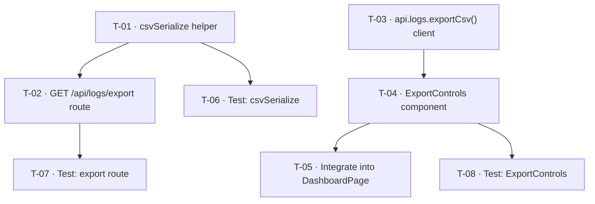

# Implementation Plan: Export Wellbeing Logs as CSV

**Story ID:** KAN-2
**Date:** 2026-05-18
**Author:** Implementation Planner
**Status:** Approved

---

## Overview

This plan decomposes the approved architecture (`docs/architecture.md`) into 8 developer-ready tasks across two parallel tracks (backend and frontend), with a final testing wave.

---

## Tasks

### ✅ T-01 — Add `csvSerialize` helper

| Field | Value |
|-------|-------|
| **Phase** | Backend/API |
| **Title** | Add csvSerialize helper function |
| **Estimate** | S (<2h) |
| **Priority** | P1 |
| **Depends On** | None |

**Description:** Create a pure function `csvSerialize(rows, headers)` in the server source that encodes an array of objects to an RFC 4180 CSV string. Must handle: field quoting (commas, double-quotes, embedded newlines in `notes`), CSV injection neutralisation (tab-prefix for fields starting with `=`, `+`, `-`, or `@`), and UTF-8 BOM (`\uFEFF`) prepended to the output for Excel on Windows compatibility (design-review F-5).

**Acceptance Criteria:**
- Returns a string beginning with `\uFEFF` (BOM)
- Header row matches the supplied `headers` array
- Fields containing commas are wrapped in double-quotes
- Fields containing double-quotes have inner quotes escaped as `""`
- Fields containing newlines are wrapped in double-quotes
- Fields beginning with `=`, `+`, `-`, or `@` are prefixed with a tab
- Empty `rows` array returns BOM + header row only (no data rows)

---

### T-02 — Add `GET /api/logs/export` route handler

| Field | Value |
|-------|-------|
| **Phase** | Backend/API |
| **Title** | Implement export route in logs router |
| **Estimate** | M (2–4h) |
| **Priority** | P1 |
| **Depends On** | T-01 |

**Description:** Add the export route to `server/src/routes/logs.ts`. Accepts `?days=N` (preset, integer clamped to 1–365) or `?start=YYYY-MM-DD&end=YYYY-MM-DD` (custom range). When both are supplied, `start`/`end` takes precedence (F-4). Validates date format with `/^\d{4}-\d{2}-\d{2}$/` and asserts `start <= end` returning `400` on violation (F-3). Queries `wellbeing_logs WHERE user_id = req.user!.id ORDER BY date DESC LIMIT 1000`. Populates `name` and `email` columns from `req.user` JWT payload — no DB JOIN (F-9). Returns `text/csv` with `Content-Disposition: attachment; filename="wellbeing-logs.csv"`. Entire handler wrapped in `try/catch`; on error: logs `[export] error=<message>` to stderr and returns `500 { error: 'Export failed' }` with no stack trace forwarded (F-2, F-7). Logs `[export] user=<id> rows=<n>` on success (F-7).

**Acceptance Criteria:**
- `GET /api/logs/export?days=30` with valid token → `200 text/csv`, correct `Content-Disposition` header
- `GET /api/logs/export` without token → `401`
- `GET /api/logs/export?start=2026-02-01&end=2026-01-01` → `400` (`start > end`)
- `GET /api/logs/export?start=bad-date` → `400` (invalid format)
- Result is capped at 1,000 rows; ordered by date descending
- Empty date range → headers-only CSV (not an error)
- DB error → `500 { error: 'Export failed' }`, no stack trace in response body

---

### T-03 — Add `api.logs.exportCsv()` client method

| Field | Value |
|-------|-------|
| **Phase** | Frontend/UI |
| **Title** | Add exportCsv method to api client |
| **Estimate** | S (<2h) |
| **Priority** | P1 |
| **Depends On** | None |

**Description:** Add `exportCsv(params: { days?: number; start?: string; end?: string })` to the `api.logs` object in `client/src/api.ts`. Uses `fetch` with `Authorization: Bearer <token>` header — JWT must never appear in the URL (architecture D-2). On `200`, reads response as `Blob`, creates an object URL via `URL.createObjectURL`, programmatically triggers an `<a download>` click, then immediately calls `URL.revokeObjectURL` to prevent memory leaks (F-8). Throws on non-`200` responses.

**Acceptance Criteria:**
- TypeScript compiles without errors
- JWT is sent in `Authorization` header, not in the URL
- `URL.revokeObjectURL` is called after every successful download trigger
- Function signature accepts `days`, `start`, and `end` as optional params

---

### T-04 — Build `ExportControls` component

| Field | Value |
|-------|-------|
| **Phase** | Frontend/UI |
| **Title** | Build ExportControls React component |
| **Estimate** | M (2–4h) |
| **Priority** | P1 |
| **Depends On** | T-03 |

**Description:** Create `client/src/components/ExportControls.tsx`. Renders a date-range selector (options: Last 7 days / Last 30 days / Last 90 days / Custom) and an "Export CSV" button. When "Custom" is selected, shows `start` and `end` date inputs. On button click: disables button and shows loading state, calls `api.logs.exportCsv()`, re-enables button in `finally` block. On error: renders an inline error message (e.g. "Export failed — please try again.") (F-1/D-6). Meets WCAG 2.1 AA: `aria-label` on the Export button, `<label>` elements associated with all date inputs, all controls keyboard-navigable (F-6).

**Acceptance Criteria:**
- Export button renders and is keyboard-focusable
- All date range selector options are present
- Custom date inputs appear only when "Custom" is selected
- All inputs have associated `<label>` elements
- Button is disabled and shows loading text during an in-flight export
- Inline error message is shown on `api.logs.exportCsv` rejection
- Button is re-enabled after both success and failure

---

### T-05 — Integrate `ExportControls` into `DashboardPage`

| Field | Value |
|-------|-------|
| **Phase** | Frontend/UI |
| **Title** | Mount ExportControls on DashboardPage |
| **Estimate** | S (<2h) |
| **Priority** | P1 |
| **Depends On** | T-04 |

**Description:** Import and render `<ExportControls />` in `client/src/pages/DashboardPage.tsx`, positioned below the stats cards section. No modifications to existing data-fetching or rendering logic on the Dashboard.

**Acceptance Criteria:**
- `ExportControls` is visible on the Dashboard page
- All existing dashboard metrics, chart, and check-in card continue to render correctly
- No TypeScript or linting errors introduced

---

### T-06 — Unit-test `csvSerialize` helper

| Field | Value |
|-------|-------|
| **Phase** | Testing |
| **Title** | Write unit tests for csvSerialize |
| **Estimate** | S (<2h) |
| **Priority** | P1 |
| **Depends On** | T-01 |

**Description:** Write a Vitest test suite for the `csvSerialize` helper covering all documented edge cases.

**Acceptance Criteria:**
- Test: plain row with all 8 columns serialises correctly
- Test: `notes` containing commas is double-quoted
- Test: `notes` containing double-quotes escapes inner quotes as `""`
- Test: `notes` containing newlines is double-quoted
- Test: field starting with `=` is tab-prefixed
- Test: empty rows array returns BOM + header line only
- Test: BOM (`\uFEFF`) is the first character of every output
- All tests pass; ≥ 90% branch coverage on the helper

---

### T-07 — Unit-test `GET /api/logs/export` route

| Field | Value |
|-------|-------|
| **Phase** | Testing |
| **Title** | Write unit tests for export route handler |
| **Estimate** | M (2–4h) |
| **Priority** | P1 |
| **Depends On** | T-02 |

**Description:** Write a Vitest test suite for the export route using the project's existing in-memory SQLite test fixture pattern.

**Acceptance Criteria:**
- Test: authenticated request with `?days=30` returns `200`, `text/csv`, correct `Content-Disposition`
- Test: authenticated request with valid `?start=&end=` returns correct rows
- Test: `?start=&end=` takes precedence when `?days=` also present
- Test: `start > end` returns `400`
- Test: unauthenticated request returns `401`
- Test: date range with no logs returns headers-only CSV (not an error)
- Test: simulated DB error returns `500 { error: 'Export failed' }`
- All tests pass

---

### T-08 — Unit-test `ExportControls` component

| Field | Value |
|-------|-------|
| **Phase** | Testing |
| **Title** | Write unit tests for ExportControls component |
| **Estimate** | M (2–4h) |
| **Priority** | P1 |
| **Depends On** | T-04 |

**Description:** Write Vitest + React Testing Library tests for the `ExportControls` component. Mock `api.logs.exportCsv` and `URL.createObjectURL` / `URL.revokeObjectURL`.

**Acceptance Criteria:**
- Test: Export button renders and is keyboard-accessible
- Test: clicking Export button calls `api.logs.exportCsv` with correct params
- Test: button is disabled during an in-flight export
- Test: inline error message is displayed when `exportCsv` rejects
- Test: button is re-enabled after error (checked in `finally`)
- Test: `URL.revokeObjectURL` is called after a successful export
- All tests pass

---

## Dependency Graph

---

## Execution Sequence

| Wave | Tasks | Can Parallelise? |
|------|-------|-----------------|
| 1 | T-01, T-03 | Yes — independent tracks |
| 2 | T-02 (needs T-01), T-04 (needs T-03) | Yes — independent tracks |
| 3 | T-05, T-06, T-07, T-08 | Yes — all unblocked after wave 2 |

**Total estimate:** ~10–14 hours across parallel backend/frontend tracks (~1 developer-day).

---

## Deferred Items (from Design Review)

The following design-review findings are addressed inline in tasks above and must not be skipped during implementation:

| Finding | Addressed In |
|---------|-------------|
| F-3 — validate `start <= end` | T-02 |
| F-4 — `start`/`end` takes precedence over `days` | T-02 |
| F-5 — UTF-8 BOM in CSV output | T-01 |
| F-6 — WCAG 2.1 AA for ExportControls | T-04 |
| F-7 — server-side logging | T-02 |
| F-8 — `URL.revokeObjectURL` after download | T-03 |
| F-9 — use JWT payload for name/email, no DB JOIN | T-02 |
