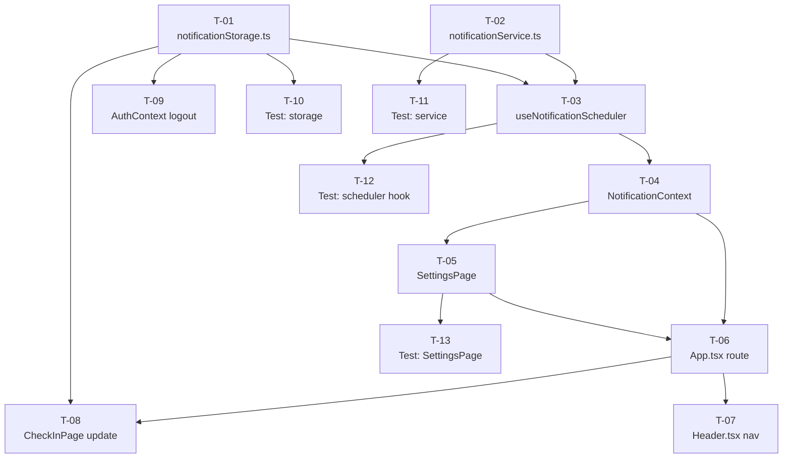

# Implementation Plan: US-001 — Daily Check-in Reminder

**Jira Story:** [KAN-1](https://santoshhawle.atlassian.net/browse/KAN-1)
**Date:** 2026-05-15
**Author:** Implementation Planner
**Status:** Approved

---

## Tasks

### T-01 · Setup · Create `notificationStorage.ts` service module

**Phase:** Setup
**Description:** Implement the `notificationStorage.ts` plain TypeScript module with all localStorage CRUD operations: `loadSettings(userId)`, `saveSettings(userId, settings)`, `isCheckedInToday(userId)`, `markCheckedInToday(userId)`, `clearCheckedInFlag(userId)`, `clearUserData(userId)`. All reads/writes wrapped in `try/catch`; reads return safe defaults; writes return `{ success: boolean }`. Keys namespaced as `wbt_notif_settings_<userId>` and `wbt_checkin_done_<userId>_<YYYY-MM-DD>`.
**Acceptance Criteria:**
- Unit tests pass for all 6 functions covering happy path + localStorage error (quota/SecurityError)
- Keys are correctly namespaced per userId
- Reads return `{ enabled: false, time: '09:00' }` on error
- Writes return `{ success: false }` on error

**Depends On:** None
**Estimate:** M (2–4h)
**Priority:** P1

---

### T-02 · Setup · Create `notificationService.ts` service module

**Phase:** Setup
**Description:** Implement the `notificationService.ts` plain TypeScript module with `requestPermission(): Promise<NotificationPermission>`, `isSupported(): boolean`, and `sendNotification(title, body)` where the notification `onclick` sets `window.focus()` + `window.location.href = '/checkin'`. No React dependencies.
**Acceptance Criteria:**
- `isSupported()` returns false when `'Notification' not in window`
- `requestPermission()` returns the browser permission value
- `sendNotification()` creates a `new Notification(...)` with correct `onclick` handler
- Module has zero React imports

**Depends On:** None
**Estimate:** S (<2h)
**Priority:** P1

---

### T-03 · Data Layer · Create `useNotificationScheduler` hook

**Phase:** Data Layer
**Description:** Implement the `useNotificationScheduler(userId, isAuthLoading, settings)` custom hook. On mount (after `isAuthLoading === false` and `userId !== null`): load settings, clear stale date flags (D-6/M-3), check suppression, compute `msUntil` target time (clamp negative to +24h per D-7), and call `setTimeout`. On timeout fire: re-check suppression, call `sendNotification`, then schedule midnight reset. Midnight callback clears flag and reschedules for tomorrow. Re-runs when `settings` changes, cancelling the previous timeout (H-3). Returns `cancel()`.
**Acceptance Criteria:**
- Hook does not run when `userId` is null or `isAuthLoading` is true
- Negative delay is clamped to next day (+24h offset)
- Stale flag from a prior day is cleared on init
- Changing `settings` cancels the old timeout and schedules a new one
- `cancel()` clears all pending timeouts

**Depends On:** T-01, T-02
**Estimate:** L (4–8h)
**Priority:** P1

---

### T-04 · Data Layer · Create `NotificationContext.tsx`

**Phase:** Data Layer
**Description:** Implement `NotificationContext` and `NotificationProvider`. Provider holds `settings` state (loaded from `notificationStorage` on auth ready), invokes `useNotificationScheduler`, and exposes `updateSettings(newSettings)` which saves to storage and updates state (triggering hook re-run). Export `useNotificationContext()` hook. Wrap `App.tsx` router with `NotificationProvider` inside `AuthProvider`.
**Acceptance Criteria:**
- `updateSettings()` persists to localStorage and causes the scheduler to cancel the old timeout and schedule a new one
- Context is accessible via `useNotificationContext()` without error
- Provider is mounted above the router in `App.tsx`
- Scheduler does not initialise until user is authenticated

**Depends On:** T-03
**Estimate:** M (2–4h)
**Priority:** P1

---

### T-05 · Frontend/UI · Build `SettingsPage.tsx`

**Phase:** Frontend/UI
**Description:** Create the `/settings` page with: (1) opt-in toggle — on enable calls `notificationService.requestPermission()`, reverts and shows inline error if denied; (2) `HH:mm` time picker — validates format before saving; (3) Save button calls `NotificationContext.updateSettings()`; (4) unsupported-browser disabled state with message "Browser notifications are not supported in this browser." Style with Tailwind consistent with existing pages.
**Acceptance Criteria:**
- Toggling opt-in ON requests browser notification permission
- Permission denial reverts toggle and shows inline error message
- Invalid `HH:mm` time is rejected with validation message
- Save persists settings via `updateSettings()` and reschedules
- Unsupported browser renders disabled toggle with explanatory message
- Page style consistent with existing Tailwind pages

**Depends On:** T-04
**Estimate:** M (2–4h)
**Priority:** P1

---

### T-06 · Frontend/UI · Update `App.tsx` — add `/settings` route

**Phase:** Frontend/UI
**Description:** Add a `PrivateRoute`-protected `<Route path="/settings" element={<SettingsPage />} />` to the existing router in `App.tsx`. Ensure `NotificationProvider` wraps the router (inside `AuthProvider`).
**Acceptance Criteria:**
- `/settings` redirects unauthenticated users to `/login`
- Authenticated users can navigate to and render `/settings`
- `NotificationProvider` is present in the React tree above the router

**Depends On:** T-04, T-05
**Estimate:** S (<2h)
**Priority:** P1

---

### T-07 · Frontend/UI · Update `Header.tsx` — add Settings nav link

**Phase:** Frontend/UI
**Description:** Add a "Settings" nav link pointing to `/settings` in `Header.tsx`, styled consistently with existing nav items.
**Acceptance Criteria:**
- Settings link is visible in the header for authenticated users
- Link navigates to `/settings`
- Visual style matches existing nav items

**Depends On:** T-06
**Estimate:** S (<2h)
**Priority:** P1

---

### T-08 · Integration · Update `CheckInPage.tsx` — mark checked-in on submit

**Phase:** Integration
**Description:** After a successful `api.logs.create(...)` call in `CheckInPage.tsx`, call `notificationStorage.markCheckedInToday(user.id)` to set the daily suppression flag. Import `useAuth` to access `user.id`.
**Acceptance Criteria:**
- After a successful check-in submission, `localStorage` contains key `wbt_checkin_done_<userId>_<today>`
- A notification does not fire on the same day after a successful check-in
- No regression on existing check-in submission behaviour

**Depends On:** T-01, T-06
**Estimate:** S (<2h)
**Priority:** P1

---

### T-09 · Integration · Update `AuthContext.tsx` — clear notification data on logout

**Phase:** Integration
**Description:** Inside the `logout()` function in `AuthContext.tsx`, call `notificationStorage.clearUserData(user.id)` before clearing auth state, to remove all user-scoped notification keys.
**Acceptance Criteria:**
- After logout, `localStorage` contains no `wbt_notif_settings_<userId>` or `wbt_checkin_done_<userId>_*` keys
- A new user logging in on the same browser gets default settings (`enabled: false`)
- Existing auth logout behaviour is not regressed

**Depends On:** T-01
**Estimate:** S (<2h)
**Priority:** P1

---

### T-10 · Testing · Unit test `notificationStorage.ts`

**Phase:** Testing
**Description:** Write unit tests for all 6 storage functions covering happy path and localStorage error scenarios. Use `vi.stubGlobal` / localStorage mock.
**Acceptance Criteria:**
- 100% function coverage across all 6 exported functions
- Tests cover: correct key format, read returns safe default on `SecurityError`, write returns `{ success: false }` on error, `clearUserData` removes all user-scoped keys, stale-date detection

**Depends On:** T-01
**Estimate:** M (2–4h)
**Priority:** P1

---

### T-11 · Testing · Unit test `notificationService.ts`

**Phase:** Testing
**Description:** Write unit tests for `isSupported()`, `requestPermission()`, and `sendNotification()`. Mock `window.Notification`. Verify `onclick` sets `window.location.href = '/checkin'`.
**Acceptance Criteria:**
- `isSupported()` returns false when `Notification` is absent from `window`
- `sendNotification()` constructs `new Notification(...)` with correct title and body
- `onclick` handler sets `window.location.href` to `'/checkin'`

**Depends On:** T-02
**Estimate:** S (<2h)
**Priority:** P1

---

### T-12 · Testing · Unit test `useNotificationScheduler` hook

**Phase:** Testing
**Description:** Write unit tests using `@testing-library/react` `renderHook`. Use `vi.useFakeTimers()` to control time. Cover: null userId guard, negative delay clamp, stale-date flag cleared on init, `cancel()` clears timeout, settings change reschedules.
**Acceptance Criteria:**
- Hook does not call `setTimeout` when `userId` is null
- Negative delay scenario schedules timeout ~24h away
- Stale flag is cleared before suppression check
- `cancel()` results in no notification firing
- Settings change causes old timeout to be cleared and new one set

**Depends On:** T-03
**Estimate:** M (2–4h)
**Priority:** P1

---

### T-13 · Testing · Integration test `SettingsPage.tsx`

**Phase:** Testing
**Description:** Write `@testing-library/react` component tests for `SettingsPage` covering: opt-in flow (permission granted), opt-in denied (toggle reverts, error shown), time picker validation (invalid input rejected), and unsupported browser disabled state.
**Acceptance Criteria:**
- All 4 test scenarios pass
- `notificationService` and `NotificationContext` are mocked
- No real `localStorage` or `Notification` API calls in tests

**Depends On:** T-05
**Estimate:** M (2–4h)
**Priority:** P2

---

## Dependency Graph

---

## Execution Sequence

| Wave | Tasks | Notes |
|------|-------|-------|
| 1 | T-01, T-02 | No dependencies — fully parallel |
| 2 | T-03, T-10, T-11 | T-03 depends on T-01+T-02; T-10/T-11 parallel with T-03 |
| 3 | T-04, T-09 | T-04 depends on T-03; T-09 only needs T-01 |
| 4 | T-05, T-12 | T-05 depends on T-04; T-12 depends on T-03 |
| 5 | T-06 | Depends on T-04 + T-05 |
| 6 | T-07, T-08, T-13 | All depend on T-06 (T-08 also needs T-01; T-13 needs T-05) |

---

## Summary

| Priority | Tasks | Total Estimate |
|----------|-------|----------------|
| P1 | T-01 through T-12 (12 tasks) | ~2.5–3 days |
| P2 | T-13 (1 task) | ~2–4h |
| **Total** | **13 tasks** | **~3 days** |
